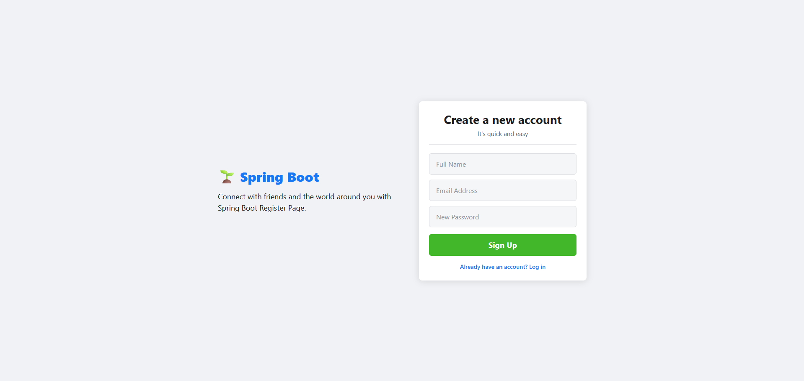

# 🌱 Spring Boot Registration Page

A full-stack user registration application built with **Spring Boot** and **HTML/CSS/JavaScript**.

## 🚀 Features

- ✅ User registration with validation
- ✅ REST API endpoints
- ✅ H2 embedded database
- ✅ Responsive UI design
- ✅ Real-time form validation
- ✅ CORS enabled for frontend

## 🛠️ Tech Stack

### Backend
- Java 17+
- Spring Boot 3.2.5
- Spring Data JPA
- H2 Database
- Maven

### Frontend
- HTML5
- CSS3
- Vanilla JavaScript (Fetch API)

## 📁 Project Structure

```

Registerpage-SpringBoot/
├── Backend/
│   └── register-app/       # Spring Boot application
├── Frontend/
│   └── Register.html       # Registration UI
└── README.md

```
## ⚙️ Setup & Run

### Backend

1. Navigate to backend folder:
   \`\`\`bash
   cd Backend/register-app
   \`\`\`

2. Run the application:
   \`\`\`bash
   ./mvnw spring-boot:run
   \`\`\`

3. Server will start on `http://localhost:8080`

### Frontend

Simply open `Frontend/Register.html` in your browser.

## 🔗 API Endpoints

| Method | Endpoint | Description |
|--------|----------|-------------|
| POST | `/api/users/register` | Register a new user |
| GET | `/api/users/all` | Get all users |
| GET | `/api/users/{id}` | Get user by ID |
| DELETE | `/api/users/{id}` | Delete user by ID |

## 🗄️ Database

H2 Console available at: `http://localhost:8080/h2-console`

**Connection Details:**
- JDBC URL: `jdbc:h2:file:./registerdb`
- Username: `sa`
- Password: *(empty)*


## 👨‍💻 Author

**Sadaham**
- GitHub: [@sadahamvishwanath](https://github.com/sadahamvishwanath)

## 📄 License

This project is open source and available under the [MIT License](LICENSE).
